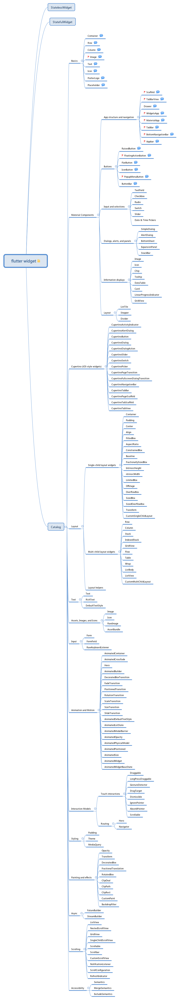

# flutter


  * [flutter](#flutter)
     * [flutter思维导图](#flutter思维导图)
     * [代码规范](#代码规范)
        * [命名](#命名)
        * [顺序](#顺序)
        * [函数规范](#函数规范)
     * [VS code 快捷键](#vs-code-快捷键)
     * [项目的结构](#项目的结构)
        * [lib 目录](#lib-目录)
           * [kit 文件目录该放什么？](#kit-文件目录该放什么)
     * [混合开发配置](#混合开发配置)
        * [ios](#ios)
        * [android](#android)
        * [flutter 版本](#flutter-版本)
        * [两端交流](#两端交流)
     * [必备技能](#必备技能)
        * [BloC 【Business Logic Component】的相关文章](#bloc-business-logic-component的相关文章)
        * [RxDart](#rxdart)
           * [PublishSubject](#publishsubject)
           * [BehaviorSubject](#behaviorsubject)
           * [ReplaySubject](#replaysubject)

## flutter思维导图



## 代码规范

好代码的代码风格一定是优雅的。一致的命名规则、一致的顺序、 以及一致的格式让代码看起来是一样的最终执行就是一样的。

> **破窗理论：** 一幢有少许破窗的建筑为例，如果那些窗不被修理好，可能将会有破坏者破坏更多的窗户。最终他们甚至会闯入建筑内，如果发现无人居住，也许就在那里定居或者纵火。一面墙，如果出现一些涂鸦没有被清洗掉，很快的，墙上就布满了乱七八糟、不堪入目的东西；一条人行道有些许纸屑，不久后就会有更多垃圾，最终人们会视若理所当然地将垃圾顺手丢弃在地上。这个现象，就是犯罪心理学中的破窗效应。

### 命名

* 类型名: 大写驼峰

  ```dart
  class SliderMenu { ... }
  class HttpRequest { ... }
  typedef bool Predicate<T>(T value);
  ```

* 库名\文件名: 小写加下划线

  ```dart
  library peg_parser.source_scanner;
  import 'file_system.dart';
  import 'slider_menu.dart';
  ```

* 导入前缀: 小写加下划线

  ```dart
  import 'dart:json' as json;
  import 'dart:math' as math;
  import 'package:javascript_utils/javascript_utils.dart' as js_utils;
  import 'package:js/js.dart' as js;
  ```

* 命名常量: 小写驼峰

  ```dart
  const pi = 3.14;
  const defaultTimeout = 1000;
  final urlScheme = new RegExp('^([a-z]+):');

  class Dice {
    static final numberGenerator = new Random();
  }
  ```

* 其他名字： 小写驼峰

    ```dart
    var item;

    HttpRequest httpRequest;

    align(clearItems) {
      // ...
    }
    ```

### 顺序

* 把 `dart:` 导入语句放到其他导入语句之前
* 把 `package:` 导入语句放到相对导入语句之前
* 把第三方 `package:` 导入语句放到其他语句之前
* 把导出（`export`）语句放到所有导入语句之后的部分
* 按照字母顺序来排序每个部分中的语句


```dart
import 'dart:async';
import 'dart:html';

import 'package:bar/bar.dart';
import 'package:foo/foo.dart';

import 'a.dart';
import 'a/b.dart';
export 'src/error.dart';
```

### 函数规范

* flutter嵌套层数最好`3`以内 改为调用
* 函数体代码不宜过多，最好在`20 - 30`行以内 过多改用调用 一个方法中尽量只做一件事
* 入参过多，建议封类型
* 模块过多建文件夹
* 加下划线代表private
* 函数参数定义要写参数类型

## VS code 快捷键
* `cmd + shift + p`  可进行 flutter 相关指令
* `cmd + shift + o` 可以快速查看当前文件中类的方法名

## 项目的结构

```sh
./
├── README.md #项目规范与开发说明
├── build #项目编译出
├── build_ios.sh # ios 抽取 flutter 编译产物的脚本
├── flutterw # 项目内置 flutter 的版本控制
├── get_version.sh
├── iOSApp
├── images # 项目图片资源
│   ├── 2.0x
│   │   └── yellow_v.png
│   └── 3.0x
│       └── yellow_v.png
├── lib # 项目实体
│   ├── config
│   │   ├── macro.dart
│   │   └── config.dart
│   ├── data
│   │   ├── data.dart
│   │   ├── native
│   │   │   └── native.dart
│   │   └── repository
│   │       ├── http.dart
│   │       └── repository_yellow.dart
│   ├── kit
│   │   ├── bloc
│   │   │   └── bloc_provider.dart
│   │   ├── kit.dart
│   │   └── widges
│   │       ├── button
│   │       │   ├── avator_button.dart
│   │       │   └── nav_back_button.dart
│   │       ├── text
│   │       │   └── overflow_text.dart
│   │       └── widget.dart
│   ├── main.dart
│   ├── pages
│   │   ├── demo
│   │   │   ├── bloc
│   │   │   │   ├── demo_cell_bloc.dart
│   │   │   │   └── bloc.dart
│   │   │   ├── demo.dart
│   │   │   ├── model
│   │   │   │   ├── demo_text.dart
│   │   │   │   └── model.dart
│   │   │   ├── page
│   │   │   │   ├── demo_page.dart
│   │   │   │   └── page.dart
│   │   │   └── view
│   │   │       ├── demo_text_cell.dart
│   │   │       └── view.dart
│   │   └── pages.dart
│   └── util
│       ├── screen_util.dart
│       └── util.dart
├── plugins # 项目插件
│   └── nativefetch
├── pubspec.lock
├── pubspec.yaml # 项目依赖配置
└── test # 单元测试
    └── widget_test.dart
```

### lib 目录

```sh
./
├── config # 项目的配置，比如一些公用宏，和开关
│   ├── Macro.dart
│   └── config.dart
├── data # 数据层
│   ├── data.dart
│   ├── native
│   │   └── native.dart
│   └── repository # 接口请求
│       ├── http.dart
│       └── repository_yellow.dart
├── kit # 通用组件
│   ├── bloc
│   │   └── BlocProvider.dart
│   ├── kit.dart
│   └── widges
│       ├── button
│       ├── text
│       └── widget.dart
├── main.dart # (入口)
├── pages # (页面）
│   ├── demo
│   │   ├── bloc
│   │   ├── demo.dart
│   │   ├── model
│   │   ├── page
│   │   └── view
│   ├── detail
│   │   ├── detail.dart
│   │   ├── page
│   │   ├── service
│   │   └── view
│   ├── notice
│   │   ├── bloc
│   │   ├── notice.dart
│   │   ├── page
│   │   └── view
│   └── pages.dart
└── util # 工具类组件
    ├── DateUtil.dart
    ├── ScreenUtil.dart
    ├── ValueUtil.dart
    └── util.dart
```

文件目录相当于整体的一个设计的层级
控制横向依赖
尽量的业务与ui分离

#### kit 文件目录该放什么？

当一个widget出现2次以上, 那么将这个widget的地位提升到 kit 中。


## 混合开发配置

### ios

iOS 的混合思路来源于此
 **[ios 嵌入 flutter 的方式](https://zhuanlan.zhihu.com/p/54796857)**

* 开发环境的切换, 通过控制 podfile 中的参数

  ```rb
  ...
  ## 开发环境设置为 true
  ## 发布环境设置为 false
  FLUTTER_DEBUG_APP=true
  ...
  ```
* 如果要产出新的 flutter 的产物需要执行 

  ```sh
  pod install
  ```

* 调试的话，先在 xcode 中运行项目到设备，然后在 debug 控制台通过搜索`flutter`查看输出：

  ```
   flutter: Observatory listening on http://127.0.0.1:49445/
  ```

  然后在这个打开终端，切换到 `flutter_module` 目录下

  ```sh
  $ .flutter/bin/flutter attach --debug-port=49445
  🔥o hot reload changes while running, press "r". To hot restart (and rebuild state), press "R". 
  An Observatory debugger and profiler on “Qson”的 iPhone is available at: http://127.0.0.1:1024/
  For a more detailed help message, press "h". To detach, press "d"; to quit, press "q".
  Restarted application in 2,157ms. 
  Application finished.
  ```

  这样 flutter 的日志输出就在 xcode 中输出了。
完全更新的话是用 `R`, 局部更新用 `r`. 这是热重载，只能是运行时的时候才有效， 如果要把修改的东西真正保留，那么需要重新执行 `pod install` , 这样的话下次重新跑到设备上才有最新的改变。


### android

### flutter 版本

因使用了 flutter_wrapper 的方式，工程的 flutter 版本依赖于根目录下的 `.flutter/` 下的 flutter 版本
这样做的好处是，项目的 flutter 环境不依赖于机子上自己安装的 flutter 环境。 可以去除一些环境配置的麻烦，统一
开发环境。

在根目录我们可以看到一个 `flutterw`, 该脚本就是 flutter 的一个别名，他把 flutter 命令的路径进行管理，从而控制版本。
你可以同 flutter 一样来使用 flutterw。

建议项目中使用 `flutterw` 来替代 `flutter`


### 两端交流

建议在 flutter 于native 通信的时候，写接口文档。这块待实际合作后后续补充进来


## 必备技能

### BloC 【Business Logic Component】的相关文章

* [flutter中使用BloC模式](https://cloud.tencent.com/developer/article/1345645)
* [Dart | 什么是Stream](https://juejin.im/post/5baa4b90e51d450e6d00f12e)
* [[译]Flutter响应式编程：Streams和BLoC](https://www.jianshu.com/p/e7e1bced6890)
* [Reactive Programming - Streams - BLoC](https://www.didierboelens.com/2018/08/reactive-programming---streams---bloc/)
* [深入了解Flutter界面开发（强烈推荐）](https://zhuanlan.zhihu.com/p/36577285)
* [响应式编程：从Streams到BLoC](https://kelvinji2009.github.io/blog/reactive-programming-streams-bloc/)
* [[译]Flutter 响应式编程：Steams 和 BLoC 实践范例(4) - 表单验证](https://www.jianshu.com/p/a4d13b50a078)

### RxDart

| Dart             | RxDart     |
| ---------------- | ---------- |
| Stream           | Observable |
| StreamController | Subject    |

#### PublishSubject

PublishSubject是一个普通的广播StreamController，但有一种情况是例外的：当stream返回一个Observable而不是一个Stream时。

PublishSubject仅向监听器发送在订阅之后添加到Stream的事件。

#### BehaviorSubject

BehaviorSubject也是一个广播StreamController，它返回一个Observable而不是一个Stream。

与PublishSubject的主要区别在于BehaviorSubject还将最后发送的事件发送给刚刚订阅的监听器。


#### ReplaySubject

ReplaySubject也是一个广播StreamController，它返回一个Observable而不是一个Stream。

默认情况下，ReplaySubject将Stream已经发出的所有事件作为第一个事件发送到任何新的监听器

>
>* StreamSubscription - 当您不再需要收听Stream时，取消订阅;
>* StreamController - 当你不再需要StreamController时，关闭它;
>* 这同样适用于RxDart Subjects，当你不再需要BehaviourSubject，PublishSubject...时，请将其关闭。


